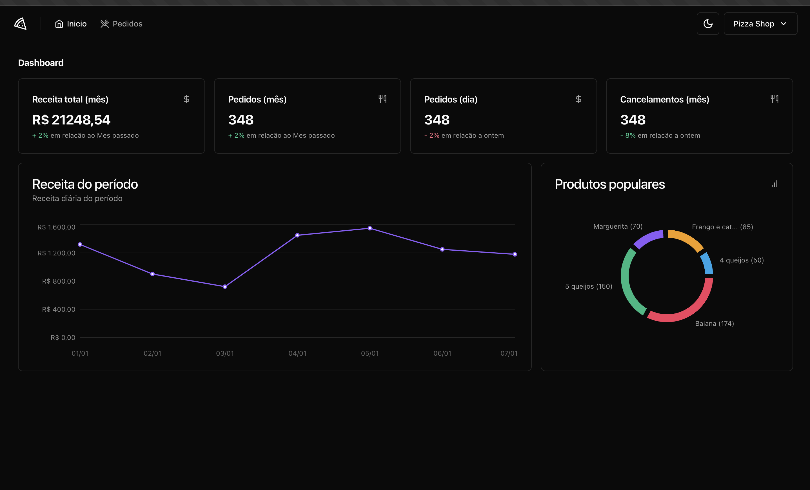

# 📸 Overview:



# 💻 Project:
Dashboard que exibe dados e estatísticas de um marketplace

# 🚀 Technologies:
### ✔️ NextJS
### ✔️ React Hook Form
### ✔️ Recharts
### ✔️ shadcnUI
### ✔️ tailwindCSS
### ✔️ TypeScript
### ✔️ Zod

# How to run

```
# Clone this repository
$ git clone https://github.com/vinnycosta9898/ignite-pizza-shop

# Go to the directory
$ cd ignite-pizza-shop

# Install Dependencies
$ npm install

# Run Web Server
$ npm run dev